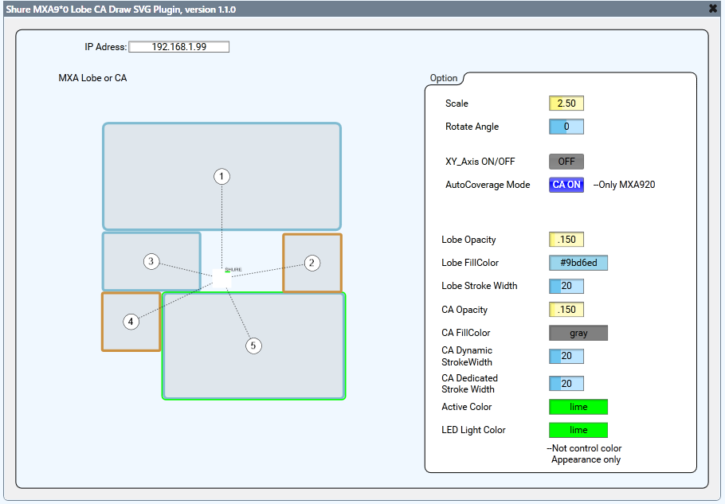
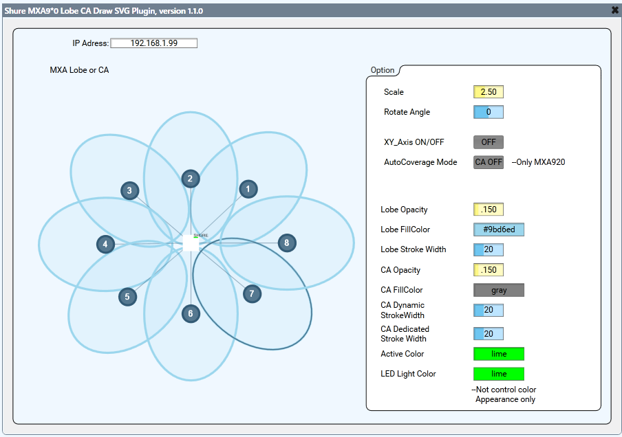

Q-SYS Plugin: Shure MXA9x0 Series Lobe or CA Draw with EzSVG

This plugin Draws the Lobe and Coverage Area of the Shure MXA9x0 series using EzSVG. 
*Note : That even if Lobes or CAs are added or removed using Shure Designer,
the data for each one is retained, which may result in drawing unused Lobes or CAs.

The required operating environment is QSD9.4 or later with a version of EzSVG that is compatible.

